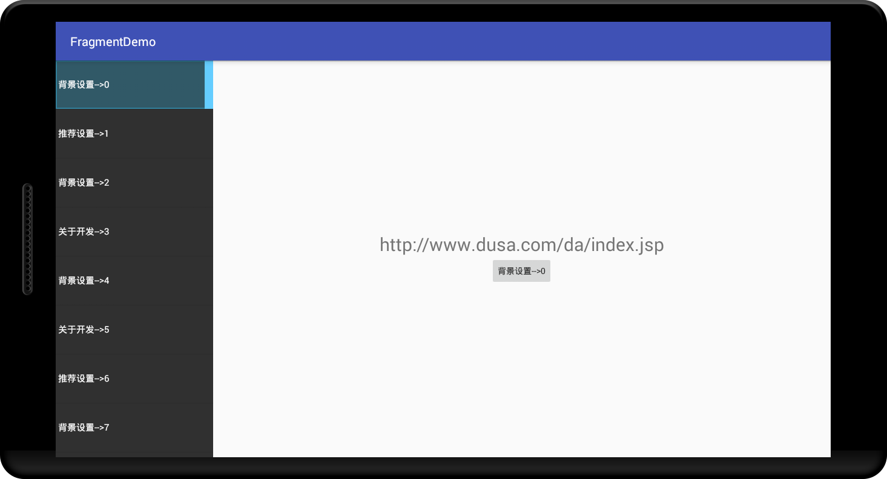
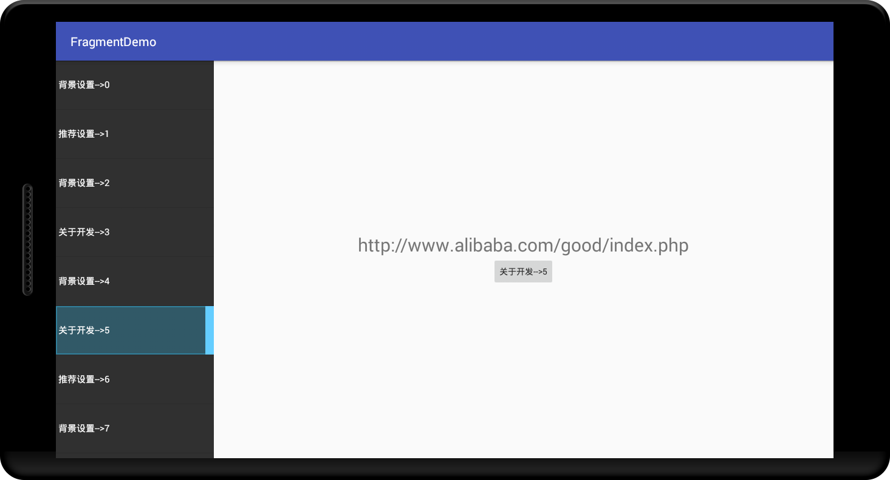
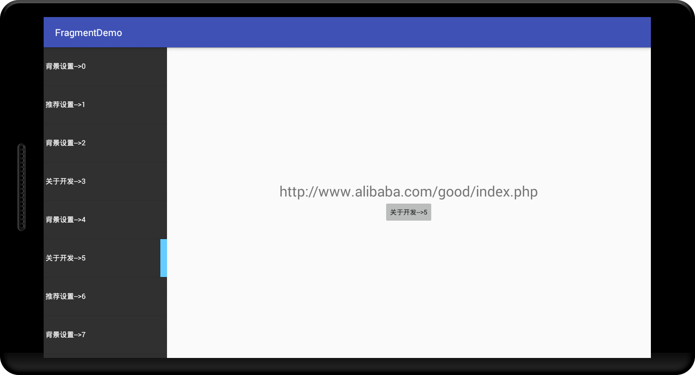
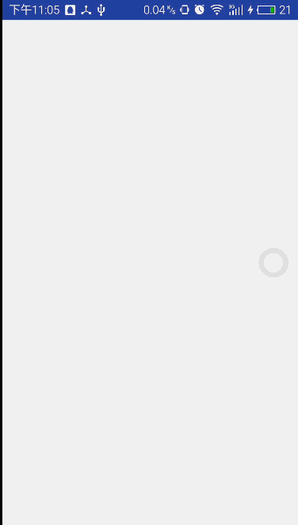

# FragmentSwitchDemo
使用ListView作为SwitchBar来切换Fragment，可以创建指定Fragment模板，Fragment的切换不销毁。
其实是为了AndroidTV写的控件，但是也可以在Android手机和Android平板上使用，类似于Flyme5.0之
前的Flyme设置界面。

左边的listview是可以上下滚动的，支持多个switchBar

中间的按钮得到了焦点

在手机中的使用demo的gif录屏，宽度按比重分配
